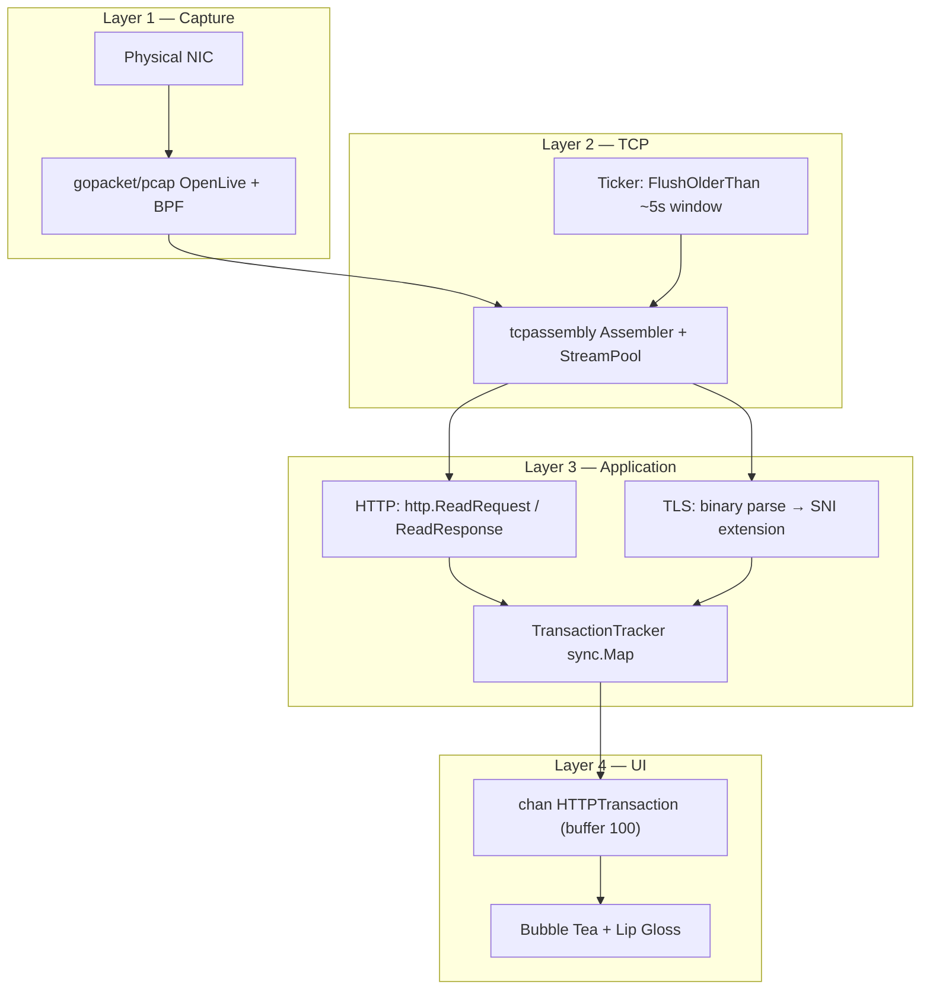

<div align="center">

# GoHTTP · Terminal HTTP / HTTPS Traffic Inspector

**Live packet capture, TCP stream reassembly, and a split-pane TUI—focused on cleartext HTTP and TLS metadata (SNI) on ports 80 and 443.**

[](https://go.dev/)
[](https://github.com/google/gopacket)
[](https://github.com/charmbracelet/bubbletea)
[]()

[Features](#-features) · [Architecture](#-architecture) · [Install](#-install--run) · [Usage](#-usage) · [Keyboard](#-keyboard-shortcuts)

</div>

---

## Why this exists

GoHTTP is a small, **read-only** observer for HTTP and HTTPS-looking traffic on your machine. It binds to a network interface with **libpcap** (Linux/macOS) or **Npcap** (Windows), applies a **Berkeley Packet Filter (BPF)**, feeds frames into **gopacket’s TCP assembler**, then:

- Parses **cleartext HTTP** requests and responses with the standard library (`net/http`).
- Parses the **TLS Client Hello** on port **443** to read **Server Name Indication (SNI)**—the hostname the client asked for—without decrypting TLS.

The result is a **fast, keyboard-driven terminal UI** (Bubble Tea + Lip Gloss + Bubbles) with a traffic list, detail pane, search, and one-key export of a transaction to disk.

> **Heads-up:** Capturing packets requires **elevated privileges** (root / Administrator) and is subject to **laws and policies** where you use it. Only monitor networks you are allowed to monitor.

---

## Features

| Area | What you get |
|------|----------------|
| **Capture** | `pcap` live capture, configurable interface and BPF; default filter targets TCP **80** and **443**. |
| **TCP** | **gopacket `tcpassembly`** for stream reconstruction; periodic flush of stale data. |
| **HTTP** | Full request/response parsing when traffic is cleartext; **8 KiB** capped body reads per direction to avoid huge allocations. |
| **HTTPS** | **SNI** from the first Client Hello record; UI shows **ENCRYPTED** for status—payloads are not visible by design. |
| **Correlation** | A **transaction tracker** pairs request and response on the same logical connection before emitting one `HTTPTransaction`. |
| **TUI** | Split view: scrollable log + inspector; **filter** by host or method; **dump** selected transaction to `dumps/`. |
| **Logging** | Optional **`inspector.log`** when the log file can be opened (see [Artifacts](#artifacts)). |

---

## Architecture



**Data path in one sentence:** packets → TCP streams → HTTP or TLS(SNI) handlers → paired transactions → Bubble Tea model → rendered panes.

---

## Repository layout

```
.
├── main.go              # Flags, capture goroutine, assembler, TUI program
├── capture/
│   └── sniffer.go       # pcap handle, BPF, PacketSource
├── models/
│   └── transaction.go   # HTTPTransaction struct
├── reassembly/
│   ├── stream.go        # Stream factory, HTTP/TLS handlers, body limits
│   ├── tracker.go       # Request/response pairing
│   └── tls.go           # Client Hello → SNI extraction
└── ui/
    └── tui.go           # Model, view, search, dump to dumps/
```

---

## Install & run

### Prerequisites

| OS | Requirement |
|----|-------------|
| **Windows** | [Npcap](https://npcap.com/) (WinPcap-compatible mode recommended). A C toolchain (e.g. [MSYS2](https://www.msys2.org/) / MinGW-w64) for **CGO** / gopacket. Run the terminal **as Administrator**. |
| **Linux** | `libpcap` dev package (e.g. `libpcap-dev` on Debian/Ubuntu). Run with **`sudo`** (or capability that allows raw capture). |
| **macOS** | `libpcap` (often present; otherwise `brew install libpcap`). Run with **`sudo`** if required by your system. |

Go **1.25+** is specified in [`go.mod`](go.mod).

### Build

```bash
git clone <your-repo-url>
cd GoHTTP
go mod download
go build -o gohttp .
```

### Run (must be privileged)

```bash
# Linux / macOS
sudo ./gohttp

# Windows (Administrator shell)
.\gohttp.exe
```

Development:

```bash
sudo go run .
```

On first launch the program prints the chosen interface and filter, waits **3 seconds**, then opens the **alternate screen** TUI.

---

## Usage

### CLI flags

| Flag | Default | Description |
|------|---------|-------------|
| `-i` | *(auto)* | Interface name (e.g. `eth0`, `wlan0`, `Ethernet`). If empty, the first **non-loopback IPv4** interface from `pcap.FindAllDevs()` is used. |
| `-f` | `tcp and (port 80 or port 443)` | **BPF** filter string passed to `SetBPFFilter`. |

**Examples**

```bash
# Explicit interface and custom port
sudo ./gohttp -i eth0 -f "tcp port 8080"

# Broader TCP (adjust to your needs)
sudo ./gohttp -f "tcp and not port 22"
```

---

## Keyboard shortcuts

| Key | Action |
|-----|--------|
| `↑` / `↓` or `k` / `j` | Move selection (**pauses** auto-scroll to latest) |
| `s` | **Snap** to live: auto-scroll on and jump to newest row |
| `/` | **Search** — filter list by substring in **host** or **method** (case-insensitive) |
| `Enter` | **Dump** the selected transaction to `dumps/dump_<host>_<unix>.txt` (JSON body pretty-printed when valid) |
| `Esc` | Clear search text / exit search mode |
| `q` or `Ctrl+C` | Quit |

Footer shows **LIVE** vs **PAUSED** (auto-scroll), and counts **HTTP** / **HTTPS** / **TOTAL**.

---

## Artifacts

| Path | Purpose |
|------|---------|
| `inspector.log` | Written when the process can open/create the file; **`log` output** is directed here so the TUI stays clean. |
| `dumps/` | Created on demand when you **dump** a transaction; **gitignored** by default. |

---

## Limitations (by design)

- **HTTPS content** is not decrypted; only **metadata** such as **SNI** from the Client Hello is shown for port **443** traffic handled as TLS.
- **Direction heuristics** use **destination/source port** (`80` / `443`) to decide request vs response handlers—custom ports need a matching BPF and may need code changes for correct direction if they are not 80/443.
- **Timestamps** for requests/responses use handler **wall clock** time, not necessarily the original packet timestamp (fine for interactive inspection, not for sub-millisecond forensics).
- **Body preview** in the UI is truncated; full response body (up to the read limit) is included in **dump** files for HTTP.

---

## Stack

- **[google/gopacket](https://github.com/google/gopacket)** — capture, layers, `tcpassembly`, `tcpreader`
- **[charmbracelet/bubbletea](https://github.com/charmbracelet/bubbletea)** — TUI loop
- **[charmbracelet/lipgloss](https://github.com/charmbracelet/lipgloss)** — styles and layout
- **[charmbracelet/bubbles](https://github.com/charmbracelet/bubbles)** — text input for search

---

## Contributing

Issues and pull requests are welcome. Please keep changes focused and consistent with existing style in the repo.

---

<div align="center">

**Built for developers who want a quick, local view of HTTP and TLS(SNI) activity without leaving the terminal.**

</div>
